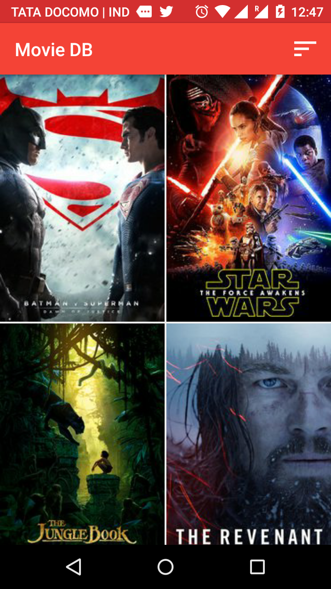
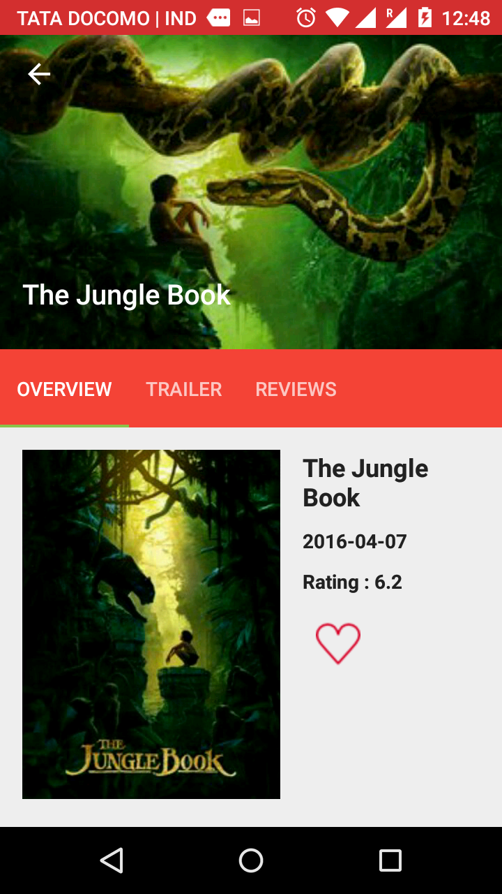
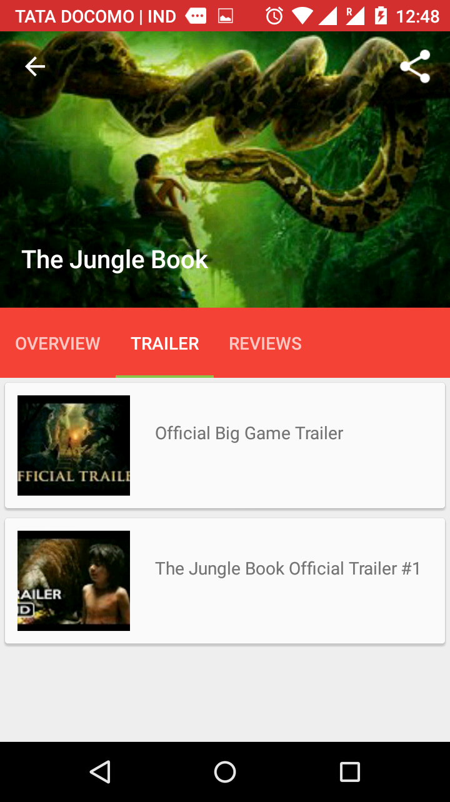
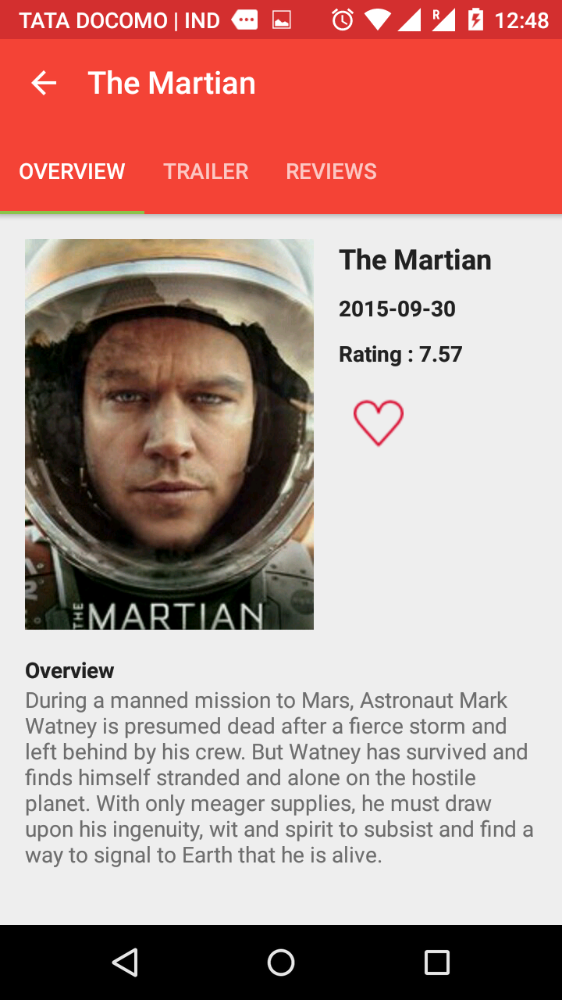

Database for Movies 

# Libraries used

* Android Design Library
* Butter Knife
* Glide

# How to use this
### Add your API key

```bash
 <string name="api_key">Your API key</string>
```
Get your api_key from  https://www.themoviedb.org

#Screenshots







